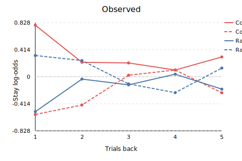

# HMMRNN

Hybrid **Hidden Markov Model + recurrent mixture-of-agents** tools for analysing sequential decision data, following the HMM-MoA and Tiny RNN literature.

## What lives in this branch

- **TinyMoARNN** — a compact GRU that mixes simple “agents” (model-free reward/choice, model-based, bias) to produce action logits. 【F:series_hmm_rnn/models.py†L26-L178】
- **HMM-MoA (`SeriesHMMTinyMoARNN`)** — an HMM whose emissions are per-phase mixtures of the canonical MF reward/choice, model-based, and bias agents. Forward–backward inference produces the phase weights that gate the agents.【F:series_hmm_rnn/models.py†L181-L356】
- **HMM-TinyRNN (`SeriesHMMTinyRNN`)** — swaps the MoA emissions for phase-specific GRU heads to obtain a smooth recurrent controller constrained by the same SeriesHMM backbone.【F:series_hmm_rnn/models.py†L359-L511】
- **Synthetic pipeline** (`series_hmm_rnn/run_synthetic_pipeline.py`) — generates long-dwell two-step trajectories, trains both models, and exports histories/metrics ready for documentation or plotting. 【F:series_hmm_rnn/run_synthetic_pipeline.py†L1-L222】
- **Plotting helper** (`scripts/plot_synthetic_results.py`) — renders lightweight SVG training curves, trial-history panels, and agent/state responsibility breakdowns directly from the JSON logs. 【F:scripts/plot_synthetic_results.py†L1-L676】

## Reproduced synthetic benchmark

The repository includes a complete, text-only reproduction of the long-dwell two-step benchmark used throughout development. Aggregate metrics, confusion matrices, and figure links are gathered in [`RESULTS.md`](RESULTS.md). 【F:RESULTS.md†L1-L77】

Headline numbers from the default run (`results/synthetic_run1`) are:

| Model | Split | NLL | Action acc. | Phase acc. |
| --- | --- | --- | --- | --- |
| SeriesHMM-TinyMoA | Train | 0.804 | 0.548 | 0.538 |
| SeriesHMM-TinyMoA | Test | 0.817 | 0.553 | 0.528 |
| SeriesHMM-TinyRNN | Train | 0.586 | 0.735 | 0.993 |
| SeriesHMM-TinyRNN | Test | 0.583 | 0.746 | 0.988 |

Regenerate them with:

```bash
python -m series_hmm_rnn.run_synthetic_pipeline --epochs 50 --B 16 --T 200 --out-dir results/synthetic_run1 --device cpu
```

Add `--save-artifacts` if you also need checkpoints, posteriors, or datasets (kept out of git by default). 【F:results/results.md†L1-L40】

## Demo real-data analysis

The `results/real_data/demo` folder captures the smoke-test run of
`series_hmm_rnn.run_real_data_pipeline` on a surrogate Mixture-of-Agents style
dataset. Replace the bundle with your converted `.npz` export to reproduce the
same reports on genuine behavioural data. 【F:results/real_data/README.md†L1-L62】

### Trial-history regressions

The plotting helper now emits per-series panels that normalise the logistic
stay coefficients into the familiar *common/rare × reward/omission* layout. This
makes it easy to verify whether each model matches the qualitative structure of
the ground-truth agents. 【F:results/real_data/demo/trial_history.json†L1-L200】



Additional panels for the fitted models and canonical agents live alongside the
demo artefacts:

- [SeriesHMM-TinyMoA](results/real_data/demo_fig/real_demo_trial_history_serieshmm_tinymoa.svg)
- [SeriesHMM-TinyRNN](results/real_data/demo_fig/real_demo_trial_history_serieshmm_tinyrnn.svg)
- [Canonical agents (MF reward/choice, model-based, bias)](results/real_data/demo_fig/real_demo_trial_history_agent_mf_reward.svg) — companion files with the `agent_*` suffix cover each policy.

Use the plotting command below after running the pipeline to regenerate the
figures for your dataset:

```bash
python scripts/plot_synthetic_results.py <run-dir> --out-dir <figure-dir> --prefix <name>
```

## Quickstart

### End-to-end synthetic pipeline

```bash
python -m series_hmm_rnn.run_synthetic_pipeline --epochs 10 --B 8 --T 120 --out-dir outputs/demo --device cpu
```

This command synthesises data, trains the MoA and TinyRNN heads, and stores JSON logs plus optional figures. 【F:series_hmm_rnn/run_synthetic_pipeline.py†L15-L222】

### TinyMoA-only experiments

```bash
python -m series_hmm_rnn.run_tiny_fit --epochs 10 --B 8 --T 120 --trace-out '' --device cpu
```

Use `--plot-out` and `--history-out` to export per-epoch diagnostics for bespoke analyses. 【F:series_hmm_rnn/run_tiny_fit.py†L1-L354】

### Plotting existing runs

```bash
python scripts/plot_synthetic_results.py results/synthetic_run1 --out-dir fig --prefix synthetic_run1
```

  The script emits SVG summaries suitable for git-friendly visual inspection. 【F:scripts/plot_synthetic_results.py†L1-L676】

## Repository layout

```
series_hmm_rnn/
  __init__.py
  agents.py            # MF-Reward, MF-Choice, MB, Bias agents
  data.py              # two-step synthetic generator
  models.py            # TinyMoARNN, SeriesHMMTinyMoARNN, SeriesHMMTinyRNN
  train.py             # shared train/eval loops
  run_synthetic_pipeline.py
  run_tiny_fit.py
results/
  synthetic_run1/      # default benchmark artefacts (JSON only)
  results.md           # metrics table for the benchmark
  visualizations.md    # SVG figure references
scripts/
  plot_synthetic_results.py
fig/                   # generated SVG charts (text-based)
configs/               # optional experiment configs
```

The older `run_series_experiment.py` baseline used during early prototyping is still available under `series_hmm_rnn/`. 【F:series_hmm_rnn/run_series_experiment.py†L1-L208】
