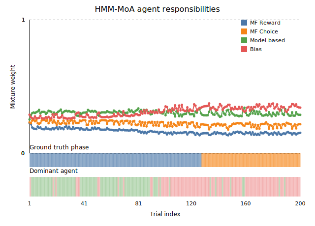
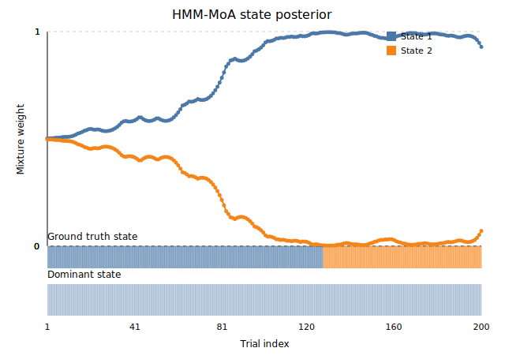
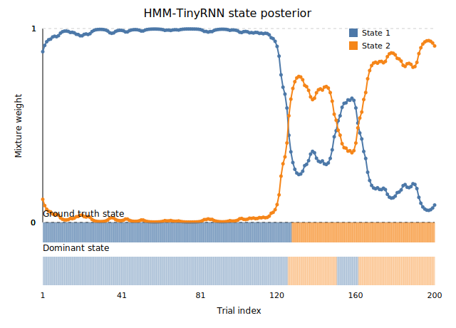

# HMM-MoA vs HMM-TinyRNN responsibility comparison

This note condenses the figures under `results/real_data/demo_fig` that expose how
the hybrid models behave internally on the demo real-data run. Each section embeds
the generated SVG and highlights the takeaways so the plots can be dropped straight
into a presentation.

## HMM-MoA agent responsibility (`real_demo_agent_mix_hmm_moa.svg`)



*Reading the plot*: the four trajectories correspond to the default Mixture-of-Agents
experts (MF reward, MF choice, model-based, bias). Values are normalised to sum to
one at every trial. The shaded band beneath the axes is colour-coded by the most
probable expert so you can immediately spot when responsibility shifts, while the
overlayed strip shows the ground-truth phase from the demo generator.

*What it shows*: in this demo session the model-based and bias experts trade off
control. The bias head dominates 107 trials while the model-based head wins 93,
leaving only small windows where the model-free components take charge. Averaged
across the run the weights settle near 0.16 (MF reward), 0.22 (MF choice), 0.30
(model-based), and 0.31 (bias), underscoring that the hybrid leans heavily on the
planning-style and static-bias policies.【F:results/real_data/demo/hmm_moa/posterior_trace.json†L1-L200】 Because the surrogate
dataset is generated by a model-based decision rule, the "ground truth" agent
would hug the model-based corner (weight 1.0 for that policy across all trials). The
ground-truth phase overlay therefore makes it obvious when the learned gating leans
on the wrong expert.【F:series_hmm_rnn/data.py†L1-L25】

## HMM-TinyRNN phase responsibility (`real_demo_agent_mix_hmm_tinyrnn.svg`)


*Reading the plot*: the RNN head does not mix hand-crafted agents, so the phase
responsibility plot reuses the state posterior to highlight which latent controller
dominates each trial. The dominant-band ribbon compresses this into a categorical
view, while the translucent overlay again marks the known phase.

*What it shows*: the RNN spends ~71% of the session in its second controller,
mirroring the way the HMM-MoA alternates between model-based and bias experts but
with smoother transitions. The overlap between the dominant ribbon and the ground
truth shows that the RNN recovers the underlying regime almost everywhere, only
diverging briefly near trial 60.【F:results/real_data/demo/hmm_tinyrnn/posterior_trace.json†L1-L200】

## HMM-MoA latent-state posterior (`real_demo_state_posterior_hmm_moa.svg`)



The HMM backbone spends roughly 81% of the session in a single phase, with only
brief excursions into the alternate state before snapping back.【F:results/real_data/demo/hmm_moa/posterior_trace.json†L1-L200】
This makes it easy to spot when the MoA gating shifts responsibility away from its
default regime. The translucent band above the dominant-state stripe encodes the
ground-truth phase annotations recorded in the dataset so you can see, at a glance,
how often the inferred posterior agrees with reality.【F:results/real_data/demo/hmm_moa/posterior_trace.json†L801-L1040】

## HMM-TinyRNN latent-state posterior (`real_demo_state_posterior_hmm_tinyrnn.svg`)



The RNN variant discovers the same two-phase structure but allocates time
differently: the second state carries ~71% of the posterior mass, leaving the
first state to handle short bursts early in the session.【F:results/real_data/demo/hmm_tinyrnn/posterior_trace.json†L1-L200】 The
same ground-truth overlay appears here; mismatched colours between the top band and
the translucent strip highlight trials where the models disagree with the known
phase identity.【F:results/real_data/demo/hmm_tinyrnn/posterior_trace.json†L801-L1040】 Contrasting the MoA and TinyRNN posteriors
makes it easy to flag trials where the two models disagree about which regime
generated the observed behaviour.

To regenerate these figures after rerunning the pipeline, execute:

```bash
python scripts/plot_synthetic_results.py results/real_data/demo \
  --out-dir results/real_data/demo_fig --prefix real_demo
```

and refresh this document if you swap in a new dataset.
