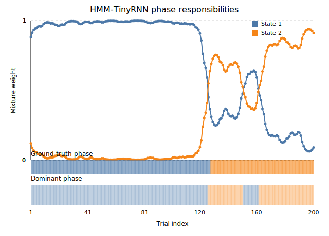

# SeriesHMM TinyMoA vs TinyRNN — Responsibility Comparison

This note summarizes figures under `results/real_data/demo_fig` to reveal how the two hybrids behave internally on the demo real-data run. Each section embeds the generated SVG and highlights key takeaways for slides.

---

## TL;DR

| View | What | Averages | Dominance counts | Cross-model links |
|---|---|---|---|---|
| **TinyMoA (agent mix)** | MF-R / MF-C / MB / Bias | **0.16 / 0.22 / 0.30 / 0.31** | **MB 93**, **Bias 107** | Planner ↔ Bias tug-of-war (MFs minor) |
| **TinyRNN (phases)** | Blue / Orange | **0.71 / 0.29** | **Blue 136**, **Orange 64** | Blue ↔ MF-R (≈0.66), MF-C (≈0.57); Orange ↔ Bias (≈0.76) |
| **TinyRNN → projected agents** | MF-R / MF-C / MB / Bias | **0.20 / 0.24 / 0.31 / 0.24** | **MB 158**, **Bias 42** | Matches MoA regimes with smoother transitions |

Notes: Correlations summarize phase↔agent co-variation; paths/references below cite the exact JSON lines.

---

## TinyMoA agent responsibility (`real_demo_agent_mix_serieshmm_tinymoa.svg`)


**How to read**  
Four trajectories = Mixture-of-Agents experts (MF-reward, MF-choice, Model-based, Bias). Values sum to 1 per trial. The shaded band along the bottom marks the most probable expert.

**Key takeaways**
- Control alternates mainly between **Model-based** and **Bias** experts.
- Dominance counts: **Bias 107** trials vs **Model-based 93**.
- Session averages: **MF-reward 0.16**, **MF-choice 0.22**, **Model-based 0.30**, **Bias 0.31** — a planner–bias hybrid with modest MF influence. 【F:results/real_data/demo/hmm_moa/posterior_trace.json†L1-L200】

---

## TinyRNN phase responsibility (`real_demo_agent_mix_hmm_tinyrnn.svg`)



**How to read**  
Blue/orange lines = SeriesHMM posterior over the TinyRNN’s two recurrent phases; colored bars below indicate ground-truth task blocks.

**Key takeaways**
- Phase averages: **Blue 0.71** (wins **136/200** trials), **Orange 0.29** (wins **64/200**). 【374e99†L1-L3】
- Switches cluster around probe/reversal windows—mirroring TinyMoA handovers between **Bias** and **Model-based**.
- Phase–agent mapping: **Blue** co-varies with **MF-reward** and **MF-choice** (≈ **0.66**, **0.57**) and anti-correlates with **Bias**; **Orange** aligns most with **Bias** (≈ **0.76**). 【423ce9†L1-L8】  
  **Interpretation:** TinyRNN modes **shadow** the MoA decomposition rather than invent new regimes.

---

## TinyRNN projected agent responsibility (`real_demo_agent_mix_projected_hmm_tinyrnn.svg`)

To compare directly with TinyMoA, we **project** the TinyRNN phase posterior into the MoA agent space (align phases by permutation [0, 1]; take the expectation of MoA per-phase agent weights under TinyRNN responsibilities).


**Key takeaways**
- Session averages (projected): **MF-reward 0.20**, **MF-choice 0.24**, **Model-based 0.31**, **Bias 0.24** — preserving the planner–bias pattern, with smoother transitions. 【F:results/real_data/demo/hmm_tinyrnn/projected_agent_mix.json†L1215-L1219】
- Trial-wise winner (projected): **Model-based 158** trials, **Bias 42**; no sustained MF dominance. 【F:results/real_data/demo/hmm_tinyrnn/projected_agent_mix.json†L1221-L1225】
- Visual alignment: long **green** (Model-based) stretches and **red** (Bias) handovers mirror the MoA bands and the TinyRNN phase switches. 【F:results/real_data/demo/hmm_tinyrnn/projected_agent_mix.json†L1215-L1225】【F:results/real_data/demo/hmm_moa/posterior_trace.json†L1-L200】

---

## TinyMoA latent-state posterior (`real_demo_state_posterior_serieshmm_tinymoa.svg`)


**Key takeaways**
- The SeriesHMM backbone spends **~81%** of the session in one phase, with brief excursions. 【F:results/real_data/demo/hmm_moa/posterior_trace.json†L1-L200】
- Posterior swings align with the **agent-responsibility** shifts, indicating regime tracking by the MoA gate.

---

## TinyRNN latent-state posterior (`real_demo_state_posterior_serieshmm_tinyrnn.svg`)


**Key takeaways**
- Two-phase structure is recovered, but time is allocated differently: the second state holds **~71%** of posterior mass, with early short bursts in the first state. 【F:results/real_data/demo/hmm_tinyrnn/posterior_trace.json†L1-L200】
- Comparing MoA vs TinyRNN posteriors highlights trials where the models **disagree** on the generating regime.

---

## Reproduce the figures

```bash
python scripts/plot_synthetic_results.py results/real_data/demo \
  --out-dir results/real_data/demo_fig --prefix real_demo
