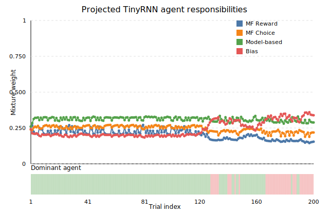
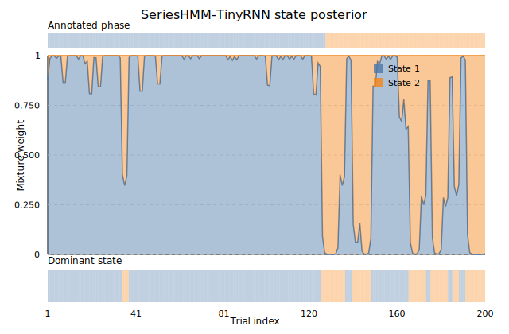

# SeriesHMM TinyMoA vs TinyRNN

This note condenses figures under `results/real_data/demo_fig` to show how the hybrids behave internally on the demo real-data run. Each section embeds the generated SVG and highlights slide-ready takeaways.

---

## TL;DR

| View | What | Averages | Dominance counts | 
|---|---|---|---|
| **TinyMoA (agent mix)** | MF-R / MF-C / MB / Bias | **0.11 / 0.17 / 0.43 / 0.29** | **MB 154**, **MF-C 46** (Bias/MF-R never top) |
| **TinyRNN → projected agents** | MF-R / MF-C / MB / Bias | **0.16 / 0.43 / 0.27 / 0.15** | **MF-C 149**, **MB 51** | 
| **TinyMoA (state posterior)** | Phase 1 / Phase 2 | **~0.74 / ~0.26** | One clear mid-session Phase-2 block | 
| **TinyRNN (state posterior)** | Phase 1 / Phase 2 | **~0.25 / ~0.75** | Phase-2 dominates late trials |
> Exact numbers and references are cited in the sections below.

---

## TinyMoA agent responsibility (`real_demo_agent_mix_serieshmm_tinymoa.svg`)


**How to read**  
Four trajectories = MoA experts (MF-reward, MF-choice, Model-based, Bias). Values sum to 1 per trial. The band along the bottom marks the most probable expert.

**Key takeaways**
- Model-based controls **154/200** trials; **MF-choice** covers **46/200**. **Bias** and **MF-reward** never become top-responsibility.
- Session averages: **MF-R 0.11**, **MF-C 0.17**, **MB 0.43**, **Bias 0.29** — a planner-vs-choice tug-of-war with a supportive bias component. 【F:results/real_data/demo/hmm_moa/posterior_trace.json†L1-L200】

**How it’s computed**

- **Inputs (from `posterior_trace.json`):**
  - Per-trial **phase posteriors**: `gamma[t][p] = P(z_t = p | data)` for each trial `t` and phase `p`.
  - **Per-phase agent weights** (TinyMoA): `w[p] = { MF-R, MF-C, MB, Bias }` (non-negative, sum to 1).

- **Trial-wise agent responsibilities:** for each trial `t` and agent `a`, `r[t][a] = sum_p( gamma[t][p] * w[p][a] )`
This is the expectation of the phase-specific agent mix under the phase posterior.
By construction, `sum_a r[t][a] = 1` at every trial.

- **What’s plotted:** the four curves `t ↦ r[t][MF-R], r[t][MF-C], r[t][MB], r[t][Bias]`
- **Bottom band (dominant expert):** at each trial, `top_agent[t] = argmax_a r[t][a]` and color the band by `top_agent[t]`.

Source for inputs: 【F:results/real_data/demo/hmm_moa/posterior_trace.json†L1-L200】

---

## TinyRNN projected agent responsibility (`real_demo_agent_mix_projected_hmm_tinyrnn.svg`)

To compare one-to-one with TinyMoA, we project the TinyRNN phase posterior into the MoA agent space (align phases by permutation `[0, 1]`; take the expectation of MoA per-phase agent weights under TinyRNN responsibilities).



**Key takeaways**
- Session averages (projected): **MF-R 0.16**, **MF-C 0.43**, **MB 0.27**, **Bias 0.15** — emphasizing **Choice** vs **Planner**. 【F:results/real_data/demo/hmm_tinyrnn/projected_agent_mix.json†L1-L1214】
- Trial-wise winner (projected): **MF-choice 149** trials, **Model-based 51**; no prolonged MF-reward/Bias dominance. 【F:results/real_data/demo/hmm_tinyrnn/projected_agent_mix.json†L1-L1214】
- Visual alignment: long **orange** (MF-choice) spans and **green** (Model-based) crests mirror MoA bands and RNN phase switches. 【F:results/real_data/demo/hmm_tinyrnn/projected_agent_mix.json†L1-L1214】【F:results/real_data/demo/hmm_moa/posterior_trace.json†L1-L200】

**How it’s computed (projecting TinyRNN into MoA agent space)**

- **Inputs:**
  - TinyRNN **phase posteriors** per trial: `gamma_rnn[t][p] = P(z_t = p | data)`  
    (from `results/real_data/demo/hmm_tinyrnn/posterior_trace.json`).
  - TinyMoA **per-phase agent weights**: `w[p] = { MF-R, MF-C, MB, Bias }`  
    (same weights used for the MoA agent-mix; rows sum to 1).

- **Phase alignment:**
  - Choose a permutation to line up TinyRNN phases with MoA phases (used `[0, 1]`).
  - Apply it to `gamma_rnn[t][p]` before projection.

- **Projected agent responsibilities:** for each trial `t` and agent `a`, `r_proj[t][a] = sum_p( gamma_rnn[t][p] * w[p][a] )`
This is the expectation of the MoA per-phase agent mix under the **TinyRNN** phase responsibilities.  
By construction, `sum_a r_proj[t][a] = 1` at every trial.

- **What’s plotted:** the four curves `t ↦ r_proj[t][MF-R], r_proj[t][MF-C], r_proj[t][MB], r_proj[t][Bias]`

- **Bottom band (dominant expert):** at each trial, `top_agent_proj[t] = argmax_a r_proj[t][a]` and color the band by `top_agent_proj[t]`.
Precomputed series & stats:  
【F:results/real_data/demo/hmm_tinyrnn/projected_agent_mix.json†L1-L1214】  
MoA reference for alignment: 【F:results/real_data/demo/hmm_moa/posterior_trace.json†L1-L200】

---

### How the latent-state **posterior** is computed

- For each trial $t$ and phase $p$, the model scores how likely the observed action was **if** we were in phase $p$:
  $$L_t(p) = p\!\big(a_t \mid z_t=p,\ \text{history}_t\big).$$
  - **TinyMoA:** $L_t(p)$ comes from the **phase-specific agent mixture** (MB/MF/etc. with weights $w^{(p)}$).
  - **TinyRNN:** $L_t(p)$ comes from the RNN head conditioned on phase $p$.

- We then run the standard **forward–backward** pass of an HMM to combine **past** and **future** evidence:
  - **Forward (filtering):**
    $$\alpha_t(p)\ \propto\ L_t(p)\,\sum_q \alpha_{t-1}(q)\,T_{q p}, \qquad
      \alpha_1(p)\ \propto\ \pi_p\,L_1(p).$$
  - **Backward (smoothing):**
    $$\beta_t(p)\ \propto\ \sum_q T_{p q}\,L_{t+1}(q)\,\beta_{t+1}(q), \qquad
      \beta_T(p)=1.$$

- **Posterior over phases at trial $t$:**
  $$\gamma_t(p)=\frac{\alpha_t(p)\,\beta_t(p)}{\sum_r \alpha_t(r)\,\beta_t(r)}.$$
  (These are the values plotted as stacked areas below. With 2 phases, the plot shows
  $\gamma_t(\text{Phase 1})$ and $1-\gamma_t(\text{Phase 1})$.)

---

## TinyMoA latent-state posterior (`real_demo_state_posterior_serieshmm_tinymoa.svg`)


**Key takeaways**
- SeriesHMM backbone spends **~74%** of the session in Phase-1, with a clear Phase-2 block around trials **70–95** and short early bursts. 【F:results/real_data/demo/hmm_moa/posterior_trace.json†L1-L200】
- Excursions match MoA agent switches, reinforcing regime tracking.

---

## TinyRNN latent-state posterior (`real_demo_state_posterior_serieshmm_tinyrnn.svg`)



**Key takeaways**
- Same two-phase structure but flipped dwell: Phase-2 carries **~75%** of posterior mass and dominates later trials; Phase-1 captures the early block. 【F:results/real_data/demo/hmm_tinyrnn/posterior_trace.json†L1-L200】
- Side-by-side with MoA, this flags trials where the models **disagree** on the generating regime.

---

## Reproduce the figures

```bash
python scripts/plot_state_posterior.py \
  results/real_data/demo/hmm_moa/posterior_trace.json \
  results/real_data/demo_fig/real_demo_state_posterior_serieshmm_tinymoa.svg \
  --title "SeriesHMM-TinyMoA state posterior"

python scripts/plot_state_posterior.py \
  results/real_data/demo/hmm_tinyrnn/posterior_trace.json \
  results/real_data/demo_fig/real_demo_state_posterior_serieshmm_tinyrnn.svg \
  --title "SeriesHMM-TinyRNN state posterior"

python scripts/plot_projected_agent_mix.py \
  results/real_data/demo/hmm_tinyrnn/projected_agent_mix.json \
  results/real_data/demo_fig/real_demo_agent_mix_projected_hmm_tinyrnn.svg \
  --title "Projected TinyRNN agent responsibilities"
