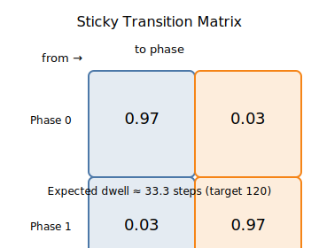
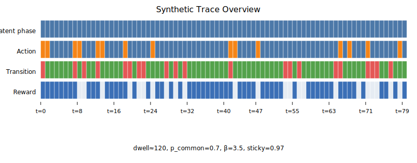
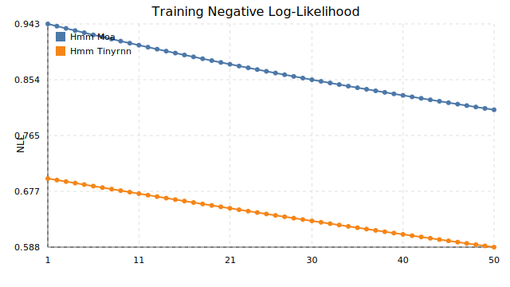
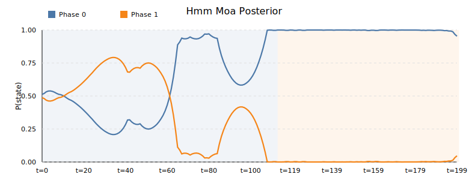
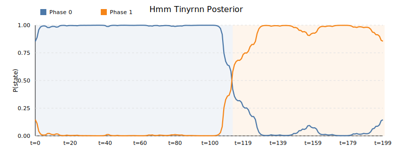
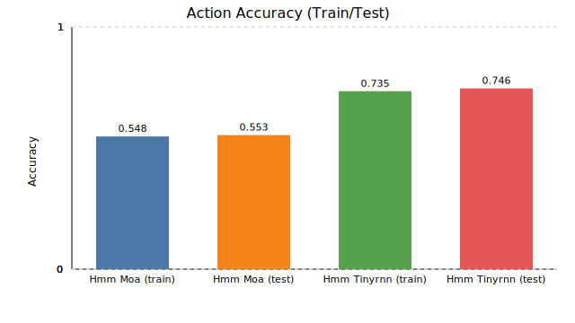

# Synthetic generator walkthrough

This note explains how the synthetic behavioral sequences are created and why
the generator is designed this way. The goal is to produce controlled yet
realistic data for testing whether an HMM or TinyRNN can recover long-lived
latent phases from observable binary choices, transitions, and rewards.

## Overview

The synthetic environment mimics a two-stage decision task often used in
behavioral experiments. At each trial, an agent chooses between two actions
(e.g., “left” or “right”) and receives a probabilistic reward. Beneath these
observable outcomes lies a **latent phase** that represents the agent’s control
mode — for example, a “habitual” (model-free) phase versus a “goal-directed”
(model-based) phase. The phase determines which action tends to be rewarded,
and therefore influences the agent’s policy.

During simulation, the agent stays in one phase for a prolonged period before
switching to the other. Each continuous block lasts roughly **120 ± 10 trials**,
meaning the generator samples dwell lengths uniformly from the range [110, 130].
The “±10” is not a confidence interval or statistical error — it is deliberate
jitter added to prevent every phase from being exactly the same length. This
irregularity makes the sequences more natural and prevents the model from
memorizing perfectly periodic switches.

Conceptually, this setup is analogous to a rat performing a binary decision
task: each trial corresponds to one left/right choice, and the animal tends to
remain in one behavioral strategy for about 120 trials before changing its
internal mode. The ±10 trials of variability represent the natural noise in how
long the animal might persist in a given strategy.


## Why the dwell time is fixed

The **120-trial dwell** is a *hard-coded property of the data generator*, not
something the HMM learns or predicts. This dwell defines the **true hidden
schedule** of when the environment changes its latent state. By fixing this
duration, we ensure that:

- The ground-truth phase boundaries are known and reproducible.  
- The HMM or TinyRNN must infer those switches purely from the observable
  signals (actions and rewards).  
- We can visually and quantitatively evaluate how well the model’s inferred
  posteriors align with these known boundaries.

If the generator itself used an internal stochastic transition matrix (like the
HMM), the true dwell times would vary unpredictably across runs, making it
harder to evaluate model accuracy. By contrast, a fixed target dwell (with
small random jitter) gives a clean benchmark for testing recovery.


## Relationship to the HMM transition matrix

When fitting the model, the HMM is initialized with a **sticky transition
matrix** whose diagonal entries are 0.97 and off-diagonal entries 0.03. This
matrix encodes a bias toward phase persistence but does not enforce the true
120-step dwell. Mathematically, a 0.97 self-stay probability corresponds to an
expected dwell of about 33 steps:

$$
\text{Expected dwell} = \frac{1}{1 - 0.97} \approx 33
$$


This discrepancy is intentional. The generator defines the true environment
(phases last ~120 steps), while the HMM starts with a weaker persistence prior
(expected 33 steps) so it must *learn* how long phases really last. If the
model’s posterior aligns with the 120-trial ground truth despite starting from
a looser prior, it confirms that the latent structure was successfully recovered
from data.

**In short:**  
The generator hard-codes realistic behavioral blocks (≈120 ± 10 trials), and
the model’s sticky transition matrix provides a flexible prior encouraging—but
not dictating—persistence. Together, these design choices create a controlled
testbed for evaluating how well different emission models (HMM–MoA vs. TinyRNN)
can detect and track latent behavioral regimes.

## Latent phase dynamics

The generator alternates between two phases that favour different stage-two
rewards. Each block lasts roughly `dwell ± 10` trials before a forced switch,
producing long contiguous segments in a single latent phase. To mirror that
structure, the fitted HMM is initialised with a sticky transition matrix whose
diagonal entries are ≈0.97, corresponding to an expected dwell of about 33
steps and encouraging the posterior to preserve phase persistence.



## Example trajectory

The figure below shows one full synthetic sequence generated by the pipeline.  
Each row represents a different variable recorded over time:

| Row | Meaning | Description |
|------|----------|-------------|
| **Latent phase** | True hidden state | Long colored blocks indicate which behavioral mode the agent is in (e.g., Phase 0 vs Phase 1). Each block lasts about 120 ± 10 trials before switching. |
| **Action** | Agent’s binary choice | Two alternating colors show left/right actions. Within a phase block, one color dominates, showing a consistent bias toward the phase-favored action. |
| **Transition** | Environment outcome | Common (prob = 0.7) and rare (prob = 0.3) transitions introduce stochasticity and force the model to infer structure from noisy outcomes. |
| **Reward** | Payoff received | Darker bars mark rewarded trials. Even in the correct phase, rewards are probabilistic, creating natural variability. |

Together, these four tracks illustrate how long-term latent structure interacts with short-term noise:
the **latent phase** drives persistent behavioral tendencies,
while the **actions, transitions, and rewards** fluctuate around that underlying regime.

The parameters shown below the plot summarize the generator setup for this run: dwell = 120 p_common = 0.7 β = 3.5 sticky = 0.97


**Interpretation:**  
Each simulated agent performs binary decisions over ≈400 trials.
It stays in one behavioral mode for roughly 120 trials before switching.
Within each mode, actions follow a softmax policy with inverse temperature β = 3.5,
transitions occur as “common” or “rare” with probabilities 0.7 / 0.3,
and rewards are stochastic.  
This produces realistic, block-structured behavior for the HMM or TinyRNN to recover.




## Training curves

The plots below show the training progress of both emission models:

- **Top panel:** Negative log-likelihood (NLL) decreases as the models fit the data.  
  The TinyRNN (orange) continues to improve across epochs, while the MoA (blue) plateaus early,
  indicating it has reached its representational limit.

- **Bottom panel:** Action prediction accuracy over epochs.
  The TinyRNN steadily increases its accuracy and surpasses the MoA, demonstrating stronger
  generalization to the latent–action mapping.

Together, these curves show that the TinyRNN learns faster and achieves a better overall fit
(lower NLL and higher accuracy) under the same HMM transition prior.




## Posterior recovery

The plots below show the posterior probabilities of each latent phase over time
for both fitted models. Each curve represents the model’s belief that the agent
is currently in Phase 0 (blue) or Phase 1 (orange), while the shaded background
indicates the true ground-truth phase sequence from the generator.

- **Top panel (HMM–MoA):**  
  The posterior transitions between phases gradually, with overlapping
  probabilities that indicate uncertainty around switch points. The MoA head’s
  emissions respond more sluggishly, often lagging behind the actual phase
  change.

- **Bottom panel (HMM–TinyRNN):**  
  The posterior transitions sharply between states, with near-perfect alignment
  to the ground-truth boundaries. The RNN-based emission captures context from
  action–reward history, enabling faster and more confident phase recovery.

These plots demonstrate that while both models share the same sticky HMM
transition prior (0.97 self-stay), the TinyRNN’s smoother emission dynamics make
it far better at inferring and tracking latent behavioral regimes.





## Action accuracy comparison

Aggregated train/test action accuracy highlights the TinyRNN smoothing benefit:
it attains substantially higher accuracy on both splits than the MoA head under
the same sticky HMM prior.




*Reproduction*: regenerate the figures by running the synthetic pipeline and
plotting helper:

```bash
python -m series_hmm_rnn.run_synthetic_pipeline --epochs 50 --B 16 --T 200 \
    --out-dir outputs/figure_run --device cpu
python scripts/plot_synthetic_results.py outputs/figure_run --out-dir fig \
    --prefix synthetic_demo
