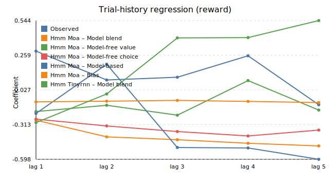

# Synthetic pipeline visualisations

These figures were generated from `results/synthetic_run1` using `scripts/plot_synthetic_results.py`. They compare the SeriesHMM-TinyMoA (mixture-of-agents) and SeriesHMM-TinyRNN variants trained on the long-dwell synthetic dataset.

*Both models converge rapidly, with the TinyRNN maintaining a consistently lower training NLL than the MoA head.*

*The TinyRNN achieves noticeably higher action accuracy throughout training, highlighting the benefit of the smooth recurrent emission.*

*Bar chart of train/test action accuracy. The TinyRNN generalises better to held-out trajectories.*

*Bar chart of train/test phase accuracy. The TinyRNN nearly recovers the latent phases, while the MoA baseline lags behind.*

*Logistic regression coefficients across five reward-history lags for the observed behaviour, both SeriesHMM models, and each constituent agent (Model-free Reward/Choice, Model-based, Bias).* 

Companion figures for choice-based and interaction-based regressions are available as `synthetic_run1_trial_history_choice.svg` and `synthetic_run1_trial_history_interaction.svg` in the same folder.
