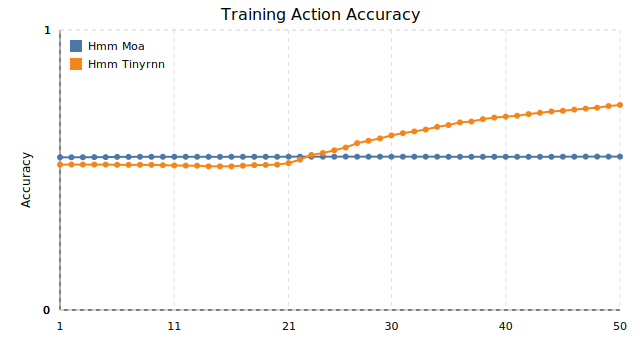

# Synthetic pipeline visualisations

These figures were generated from `results/synthetic_run1` using `scripts/plot_synthetic_results.py`. They compare the HMM-MoA and HMM-TinyRNN variants trained on the long-dwell synthetic dataset.

*Both models converge rapidly, with the TinyRNN maintaining a consistently lower training NLL than the MoA head.*

*The TinyRNN achieves noticeably higher action accuracy throughout training, highlighting the benefit of the smooth recurrent emission.*

*Bar chart of train/test action accuracy. The TinyRNN generalises better to held-out trajectories.*

*Bar chart of train/test phase accuracy. The TinyRNN nearly recovers the latent phases, while the MoA baseline lags behind.*

*Per-trial mixture weights for the Model-free value, Model-free choice, Model-based, and Bias agents after aligning the latent
phases. The new labels make it easy to read off how strongly each component contributes at every point in the trajectory.*
